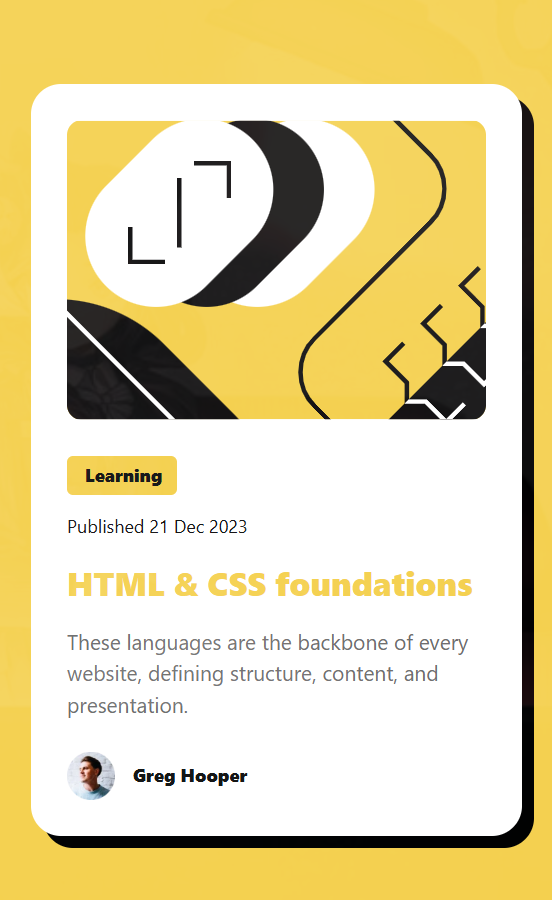
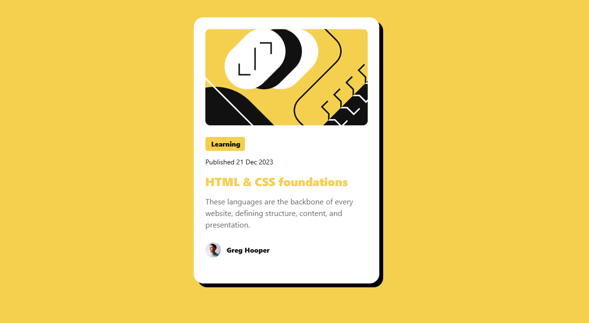

# Frontend Mentor - Blog preview card solution

这是 [Frontend Mentor 上的博客预览卡片挑战](https://www.frontendmentor.io/challenges/blog-preview-card-ckPaj01IcS) 的解决方案。Frontend Mentor 挑战通过构建实际项目帮助您提高编码技能。

## Table of contents

- [Overview](#overview)
  - [The challenge](#the-challenge)
  - [Screenshot](#screenshot)
  - [Links](#links)
- [My process](#my-process)
  - [Built with](#built-with)
  - [What I learned](#what-i-learned)

## Overview

### The challenge

Users should be able to:

- See hover and focus states for all interactive elements on the page

### Screenshot

mobile:


desktop:


### Links

- 解决方案URL: [solution URL](https://github.com/Regliya/Blog-preview-card)
- 在线预览URL: [live site URL](https://regliya.github.io/Blog-preview-card/)

## My process

### Built with

- 语义化 HTML5 标签
- CSS 自定义属性（CSS 变量）
- Flexbox 布局
- 移动优先（Mobile-first）的工作流程
- 响应式图片
- CSS 嵌套语法（现代 CSS）

### What I learned

**灵活的图像处理**:

```css
    img{
        object-fit: cover;
  
    /*  
            object-fit: contain; 保持其宽高比，同时使图像适合其内容框
            object-fit: cover; 保持其宽高比，同时使图像填充其内容框
            object-fit: fill; 不保持其宽高比，拉伸图像以填充其内容框
            object-fit: none; 保持其原始大小，不进行缩放
            object-fit: scale-down; 将图像缩小到适合其内容框的大小，同时保持其宽高比
        */
    }
```

**伪类选择器**:

```css
 a h1:hover , a h1:focus , a h1:active{
                color: var(--Yellow);
            }
```
